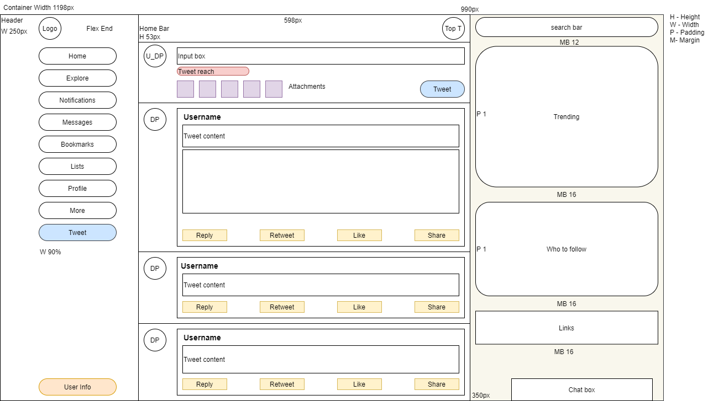

<h1>Twitter Home</h1>
<blockquote>
This is a twitter home clone made using HTML5, CSS, Javascript.
</blockquote>
 
<h2>Overview</h2>
<ul>
    <li>Page is divided in three sections-</li>
    <ul>
        <li>Left section tab which is navigation bar.</li>
        <li>Middle section consisting of tweet feed.</li>
        <li>Right section with search bar and suggestions.</li>
    </ul>
    <li>Left Section is the header and contains-</li>
    <ul>
        <li>Tweeter logo.</li>
        <li>Navbar.</li>
        <li>New tweet button.</li>
        <li>User info on bottom.</li>
    </ul>
     <li>Middle section contains-</li>
    <ul>
        <li>Home bar with top tweets option - Fixed to top.</li>
        <li>Add new tweet text box with attachment option.</li>
        <li>Tweet Feed.</li>
    </ul>
    <li>Right Section contains</li>
    <ul>
        <li>Search box - Fixed to top.</li>
        <li>Trending topics card.</li>
        <li>Follow suggestions card.</li>
        <li>Useful links.</li>
    </ul>
    <li>Messages box fixed at bottom right corner.</li>
</ul>

<h2>Wireframe</h2>
